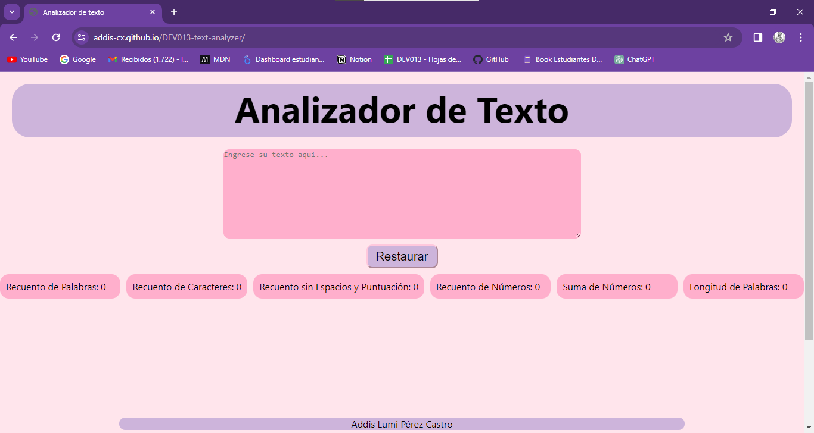

# Analizador de texto
Una aplicación web cuya finalidad es analizar el texto ingresado por el usuario y evaluar los siguientes parámetros:

   - Recuento de palabras.
   - Recuento de caracteres.
   - Recuento de caracteres excluyendo espacios y signos de puntuación.
   - Recuento de números.
   - Suma total de números.
   - Longitud media de las palabras.

La herramienta proporciona una manera eficaz de obtener información detallada sobre el contenido del texto, permitiendo al usuario comprender mejor las características fundamentales del mismo.

## Tecnologías Utilizadas:
  
  - HTML, CCS y JavaScript.
  - Github Pages para el despliegue del sitio web.
  - Aquí está el enlace: https://addis-cx.github.io/DEV013-text-analyzer/

## 4. Funcionalidades

En esta sección, detallaremos de manera clara y concisa la función principal de la aplicación web, así como cada una de las características que incluye.

El listado de funcionalidades es el siguiente:

1. La aplicación debe permitir al usuario ingresar un texto mediante un cuadro de texto.

2. La aplicación calcula en tiempo real las siguientes métricas a medida que el usuario escribe su texto:

    - **Recuento de palabras**: La aplicación cuenta el número de palabras en el texto de entrada y muestra este recuento al usuario.
    - **Recuento de caracteres**: La aplicación cuenta el número de palabras en el texto de entrada y muestra este recuento al usuario.
    - **Recuento de caracteres excluyendo espacios y signos de puntuación**:
    la aplicación debe poder contar el número de caracteres en el texto de
    entrada, excluyendo espacios y signos de puntuación, y mostrar este recuento
    a la usuaria.
    - **Recuento de números**: La aplicación cuenta la cantidad de números en el texto de entrada y muestra este recuento al usuario.
    - **Suma total de números**: La aplicación suma todos los números presentes en el texto de entrada y muestra el resultado al usuario.
    - **Longitud media de las palabras**: La aplicación calcula la longitud media de las palabras en el texto de entrada y la presenta al usuario.

3. La aplicación proporciona la capacidad de limpiar el contenido del cuadro de texto mediante un simple clic en un botón.
